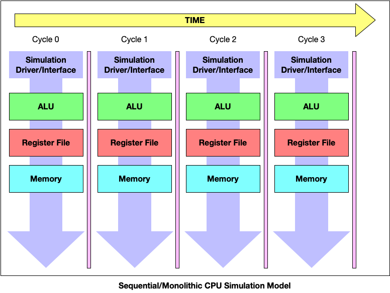
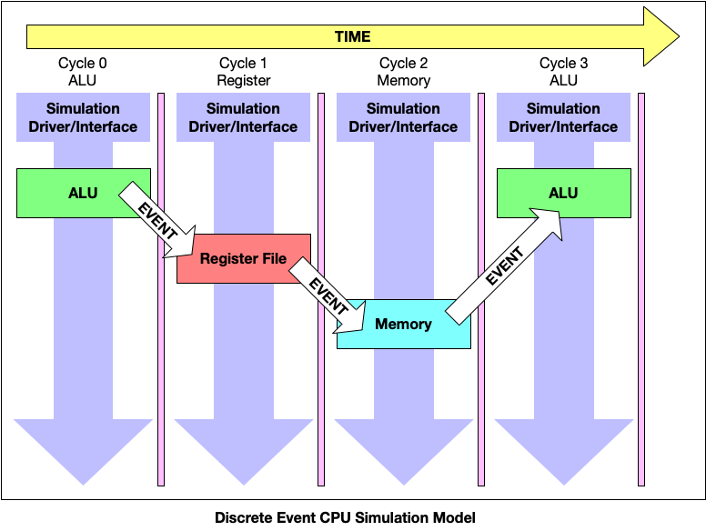

# Level 0 Tutorial: Parallel Discrete Event Simulation

## What is a Parallel Discrete Event Simulation:

Parallel Discrete Event Simulation (PDES), sometimes called distributed 
simulation, refers to the execution of a single discrete event simulation 
program on a parallel computer. Because of the large amounts of time on 
sequential machines, PDES can be used to assist with engineering, 
computer science, biological systems, economics and military application ventures. This 
collection of sequential simulators—possibly running on different 
processors are logical processes communicating exclusively by 
exchanging messages.  

How is this differnet from traditional "simulators?"  Traditional 
simulators often operate with sequential execution models.  For 
every new iteration of simulated wall clock time, the simulator 
must consider updates to each and every simulated component.  This 
often implies very large runtime overheads for even simplistic 
simulation models.  In contast, PDES models only update the portions 
of the simulation model (or models) that register changes (events) 
within the given simulated window of time. In this manner, A discrete 
event simulation model assumes the system being simulated 
only changes state at discrete points in simulated time. The 
simulation model jumps from one state to another upon the 
occurrence of an event. 

For example, consider a simulation model of a basic CPU.  The CPU 
contains a core (ALU), some register state (registers) and some 
memory state (DRAM).  In a traditional, sequential simulation model, 
the simulator must consider the potential changes to every portion 
of the ALU (adder, multiplier, etc), the register file and all of memory.  
This may become quite expensive given a sufficiently complex CPU.  Notice 
in the figure above that we have a top-level simulation driver that activates 
each portion of the simulation model on every simulated cycle, regardless of 
the activity being performed.

However, in a discrete event simulation model, only the portions of the CPU that *change* 
for each cycle need to be considered by the simulator.  If on cycle-15, we 
execute a multiplication operation and cycle-16, we write the result to the register 
file, then we only need to handle the state change for the ALU on cycle-15 
and only the state change for the register file on cycle-16.  If the CPU goes 
into a sleep or idle state, then the simulator does not need to consider any 
operations at all on the given cycle.  In the example depicted below, we utilize 
the same basic CPU model from above to depict a basic discrete event simulation.  
We utilize the same basic simulation driver that executes the simulation using 
individual cycle-based timing.  For each cycle, we only activate the portion of the model 
that is required.  Each new activation is triggered from the previous cycle using 
an *event*.

These *events* are an important, disctinctive feature of discrete event 
simulation.  Events can be utilzied to parallelize simulations across multiple cores 
and multiple nodes of a cluster.  In DES/PDES models, the simulations are *event-centric*.  
In these event-centric simulations, we have the ability to utilize event queues 
in order to trigger complex sets of simulation events only when necessary/appropriate.  

## Discrete Event Simulators
- [Structural Simulation Toolkit](http://sst-simulator.org/)
- [SimPy](https://simpy.readthedocs.io/en/latest/)
- [POSE](https://charm.cs.illinois.edu/research/pose)

## References
- [PDES Lecture](http://www.cs.wm.edu/~andreas/umsa/lectures/cs-sim-pdes.pdf)
- [Optimization for PDES](http://www.cs.binghamton.edu/~nael/pubs/tpds13.pdf)
- [PDES in Biological System Simulation](https://pubmed.ncbi.nlm.nih.gov/9390232/)

